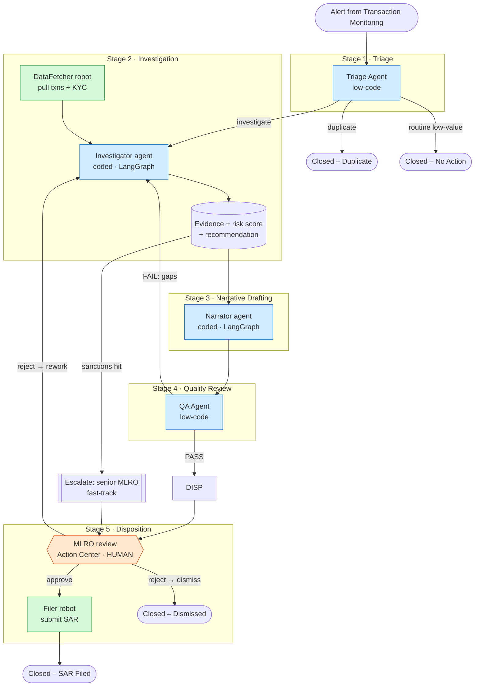

# Architecture

Sentinel is an **agentic case-management** system. UiPath Maestro Case is the
control plane; agents (low-code + coded), robots, and a human are the actors it
orchestrates. Nothing acts outside Maestro's governance and audit trail.

## Actor map

| Actor | Built with | Type | Why this actor |
|---|---|---|---|
| Case Manager Agent | Maestro Case (native) | Orchestrator | Owns case state/lifecycle, decides paths |
| Stage Manager Agents | Maestro Case (native) | Orchestrator | Drive each stage to completion + SLAs |
| Triage Agent | Agent Builder | Low-code agent | Dedup/classify/route — fast, policy-grounded |
| Investigator | Python + LangGraph (`uipath-langchain`) | Coded agent | Multi-step reasoning over messy evidence |
| Narrator | Python + LangGraph (`uipath-langchain`) | Coded agent | Drafts regulator-grade narrative; HITL gate |
| QA Agent | Agent Builder | Low-code agent | Strict, schema-checkable sufficiency review |
| DataFetcher / Filer / Notifier | Studio Web (API Workflows + RPA) | Robot | Deterministic system-of-record actions |
| DocIntake | Document Understanding (IDP) | Robot | Structured extraction from KYC docs |
| MLRO / Compliance Officer | Action Center task | **Human** | Legally accountable for filing/dismissal |

## Case lifecycle

## Where humans stay in charge
- **Disposition (mandatory):** no SAR is filed and no alert dismissed without an
  MLRO decision in Action Center. The Narrator graph literally **suspends** at
  `interrupt()` until the human submits.
- **Escalation:** sanctions exposure and SLA breaches route to a supervisor.
- **Loop guard:** after 2 QA rework cycles a human analyst takes over.

## Exception & failure handling
| Situation | Handling |
|---|---|
| Duplicate alert | Triage links + auto-closes |
| Sanctions/PEP hit | Fast-track escalation, priority raised |
| Thin evidence (QA FAIL) | Loop back to Investigation with targeted `gaps` |
| Repeated QA failure | Loop guard → human analyst |
| SLA breach | Maestro auto-escalates to supervisor + Notifier |
| Source system / API error | Robot retry policy in Orchestrator; case parks in "Blocked" with a follow-up task |
| LLM unavailable | Agents fall back to deterministic logic (never hard-fail the case) |

## How decisions stay auditable
Every evidence item carries a `source`. The risk score is a **transparent
weighted sum** over evidence severity (see `synthesize.py`) — the LLM writes the
rationale, never the score, so a reviewer can reconstruct the decision. Maestro
records every stage transition, agent run (Orchestrator job logs), and the human
decision (Action Center) against the case.

## Technology boundaries (governance)
Agents never touch source systems directly — robots/API Workflows do, and hand
clean data to agents. This keeps credentials in the UiPath vault, keeps actions
logged, and means swapping a connector never touches agent logic.

## External frameworks under UiPath governance
The Investigator and Narrator are **LangGraph** graphs (LangChain ecosystem),
packaged with the **UiPath Python SDK** and run as Orchestrator processes. The
design also supports a **CrewAI** variant of the Investigator (role-based crew:
Entity Analyst, Transaction Analyst, OSINT Analyst, Lead Investigator) — same
inputs/outputs, swappable behind the Maestro stage. UiPath remains the
orchestration and governance layer regardless of framework.
